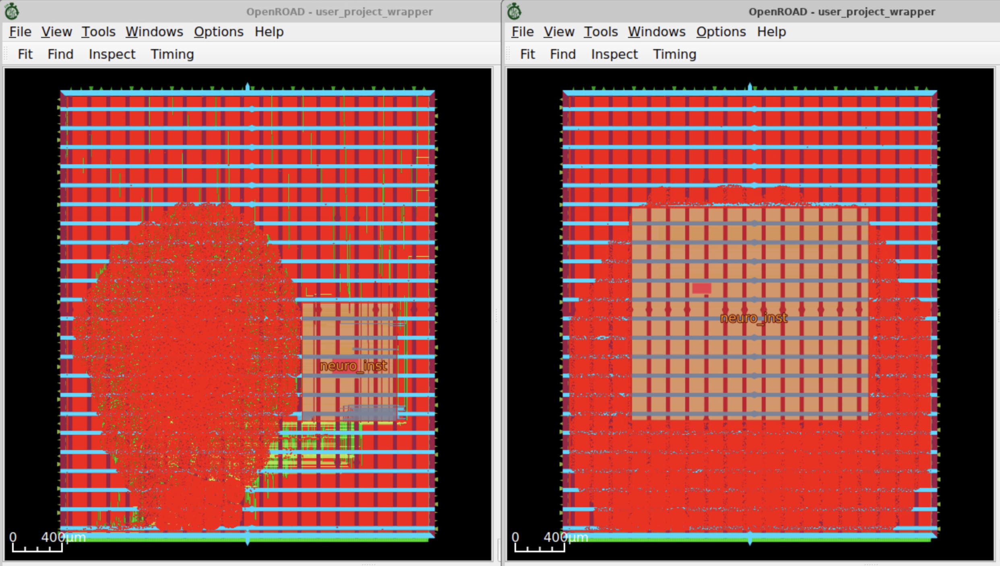

# Notes from Neuromorphic Macro Change

At November 26th, 2025, 10:06 PM (PT), it was communicated that a new version of the Neuromorphic IP needed to be integrated from [this repo](https://github.com/Baavanes/caravel_user_Neuromorphic_X1_32x32/tree/main).

There were both new artifacts (`.gds`, `.lib`, etc.) as well as a `./hdl(to_replace_in_IP)` directory. We were directed to manually replace the `ip/Neuromorphic_X1_32x32/hdl` directory with this new one.

There was a small change to the interface, adding one additional analog pin.

More importantly, **the area of the macro increased dramatically**. Below, on the left is the hardened design with the old macro, while on the right is a flow that failed due routing congestion with the new macro.



Unfortunately, this has led to consistent routing congestion failures. Specifically, on step `38-openroad-globalrouting`, the following `ERROR` was seen:
```
The following error was encountered while running the flow:
OpenROAD.GlobalRouting failed with the following errors:
[GRT-0118] Routing congestion too high. Check the congestion heatmap in the GUI.
LibreLane will now quit.
```

This error could be avoided by changing `GRT_ALLOW_CONGESTION` to `true`. This sucessfully allows `make user_project_wrapper` to pass without error. However, this leads to LVS errors in `make run-precheck`. Unfortunately, it seems like the lowest possible `PL_TARGET_DENSITY_PCT` that fits with this macro is `11`, and runs into the above problems (congestion or LVS precheck errors).

We also tried moving the macro further away from the center of the floorplan. Unfortunately, the same problems still appeared.